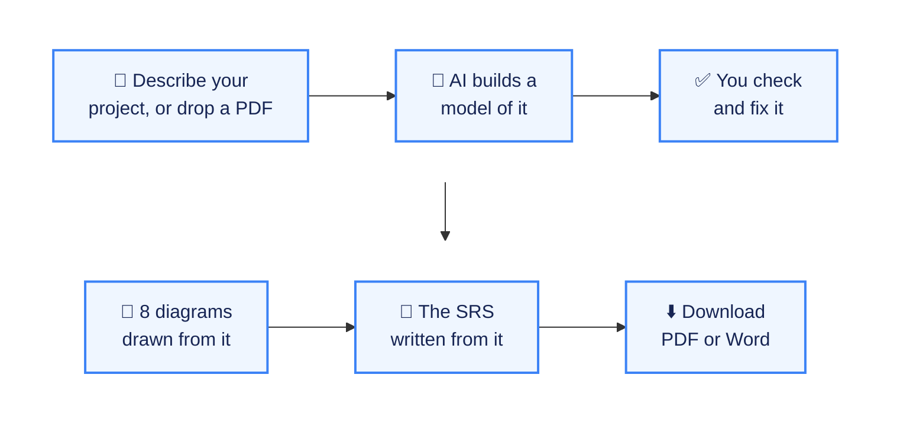
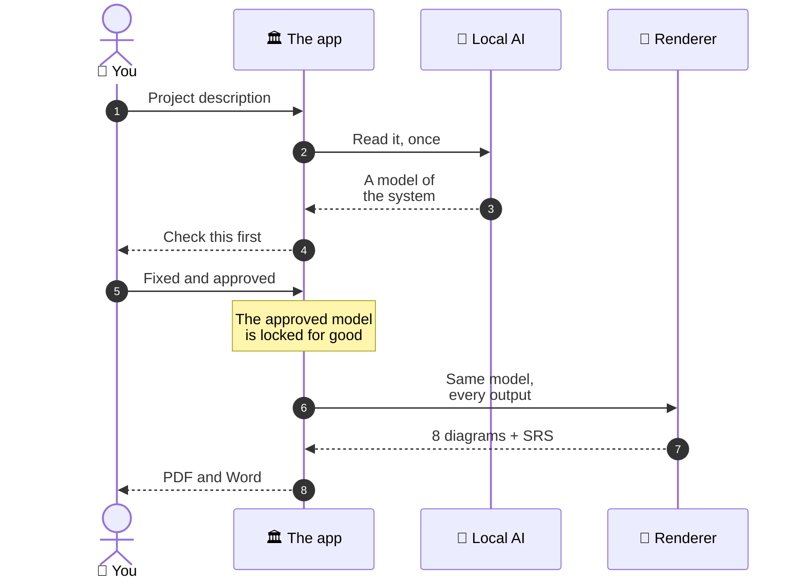
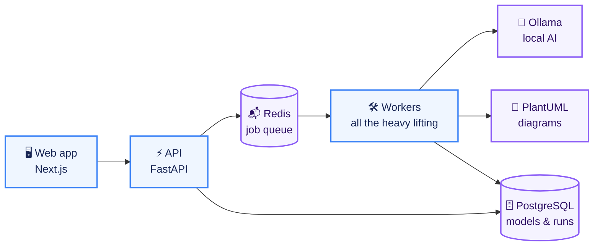

<div align="center">

# 🏛️ Code to Diagram

### Describe your project once. Get every diagram and the requirements document — all in agreement.

**Turns a project description into 8 matching UML and ER diagrams plus a formatted IEEE-830<br/>Software Requirements Specification, as PDF and Word — free, private, on your own computer.**

<br/>

   
<br/>
    

   

</div>

---

## 👋 In 30 seconds

<table>
<tr>
<td width="22%">

😟 **The problem**

</td>
<td>

College projects need a requirements document **and** a full set of UML diagrams. Change one thing and you have to fix it in seven other places — and by hand-in day, the diagrams and the document no longer agree with each other.

</td>
</tr>
<tr>
<td width="22%">

💡 **The idea**

</td>
<td>

Keep **one** source of truth. The AI reads your description once and builds a model of your system. You check it. Then every diagram and every section of the document is drawn from that same approved model — so they can't disagree, because they were never separate.

</td>
</tr>
<tr>
<td width="22%">

🎯 **Who it's for**

</td>
<td>

Students and teams who have to hand in an SRS with its diagrams, in their department's format.

</td>
</tr>
<tr>
<td width="22%">

🚦 **Where it is**

</td>
<td>

Works end to end: extraction, review, all eight diagrams, the document, both exports and the templates — with 680+ automated tests. It runs on your own machine with a free local AI model.

</td>
</tr>
</table>

---

## 🧭 How it works



Nothing is generated until you approve the model in step 3.

---

## ✨ What you get

<table>
<tr>
<td width="50%" valign="top">

### 📐 Eight diagrams, one story
**Class, Use Case, Sequence, Activity, State, Component, Deployment** and **Entity-Relationship** — the standard set most departments ask for, with every name spelled identically across all eight.

</td>
<td width="50%" valign="top">

### 📄 A finished SRS
An IEEE-830 requirements document with numbered sections, a table of contents, a list of figures, a glossary and every diagram embedded and captioned in the right place.

</td>
</tr>
<tr>
<td valign="top">

### 🎓 Your department's format
Three templates built in — including a bound project report with a certificate page — and a new one is just a settings file. Export to **PDF** or editable **Word**.

</td>
<td valign="top">

### 🙅 It won't make things up
If a description is too thin to describe a real system, it says exactly what's missing instead of inventing parts that were never there.

</td>
</tr>
<tr>
<td valign="top">

### 🔁 Redraw just one diagram
Unhappy with one figure? Regenerate that diagram alone; the rest of the set carries forward unchanged.

</td>
<td valign="top">

### 🔒 Free and private
The default AI model runs on your own computer through **Ollama**. Nothing about your project leaves your machine, and there's no bill.

</td>
</tr>
</table>

---

## 📮 From description to document



The AI runs **once**, to build the model. Everything after that is drawn from the model by ordinary code — which is why the same model always produces exactly the same diagrams.

---

## 🏗️ How it's built



| Layer | Tool | Why this one |
|---|---|---|
| 🖥️ Web app | **Next.js + TypeScript + Tailwind + shadcn/ui** | A clear review screen for checking the model before anything is generated |
| ⚡ API | **FastAPI (Python)** | Answers instantly; slow work is handed to the workers |
| 🛠️ Workers | **arq + Redis** | Generation never runs inside a web request, so nothing times out |
| 🗄️ Database | **PostgreSQL** | Stores each model; an approved version can never be edited |
| 📐 Diagrams | **PlantUML** (+ Mermaid) | Draws all eight diagram types, including ones Mermaid can't |
| 🤖 AI | **Ollama, qwen2.5:7b** | Free, local, private — and swappable for any OpenAI-compatible server |
| 📦 Running it | **Docker Compose** | One command starts every piece |

---

## 🛡️ Built to be trusted

Each promise below has an automated test that fails if it ever stops being true.

| | Promise | How it's held |
|---|---|---|
| 🧩 | **Every diagram agrees with every other** | Names are checked to be identical, character for character, across all eight diagrams on every run. |
| 🚪 | **Nothing is generated before you approve** | The code has no path from a draft model to the diagrams except your confirmation. |
| 🔒 | **An approved model can't change** | The database itself refuses to edit or delete a confirmed version. |
| 🎯 | **Same model, same output** | Golden-file tests compare the generated diagrams byte for byte. |
| 🤖 | **The AI is kept in one place** | A scan fails the build if a model name appears anywhere outside the one module allowed to talk to the AI. |
| 🛡️ | **Uploaded files are data, not orders** | Text from an uploaded PDF is fenced off, so it can't instruct the AI. |
| 🔗 | **Downloads are protected** | Links are signed and expire. |

| Tests | Count |
|---|---|
| 🐍 Python — the model, extraction, diagrams, document, exporters | 602 |
| ⚡ API | 3 |
| 🖥️ Web app | 82 |

Sixty of the Python tests need the PostgreSQL database that the Docker stack provides; the rest run anywhere. There's also an end-to-end acceptance test, `make at1`, which builds a complete 18-page document from scratch.

---

<a name="roadmap"></a>

## 🗺️ Roadmap

| Status | Milestone |
|:---:|---|
| ✅ | Extraction from text or PDF, with an honest refusal when there's too little to go on |
| ✅ | The review screen and the approval gate |
| ✅ | All eight diagrams, kept consistent, and redrawing one at a time |
| ✅ | The IEEE-830 SRS, exported to PDF and Word, in three built-in templates |
| ✅ | A metrics dashboard that tells a careful review from a rubber stamp |
| 🔜 | Templates collected from real university departments *(today's three are reconstructed)* |
| 🔜 | Moving generated files to object storage |
| 💭 | Left out of version 1 on purpose: reading a project from GitHub or a ZIP, team collaboration, and more document types such as high- and low-level design |

---

## 📁 What's in this repository

```
📦 Code to Diagram
├── 📂 web/         the web app you use
├── 📂 api/         the API the web app talks to
├── 📂 worker/      where every diagram and document is generated
├── 📂 shared/      the model, the AI gateway, diagrams, the SRS and exporters
├── 📂 schemas/     the model's schema, from which the web app's types are generated
├── 📂 acceptance/  the end-to-end test that defines "it works"
└── 📂 docs/        the developer guide and milestone notes
```

The product thinking is written down too: [`PRD_Code_to_Diagram.md`](PRD_Code_to_Diagram.md) and [`SRS_Code_to_Diagram.md`](SRS_Code_to_Diagram.md).

---

## 👩‍💻 For developers

You need **[Docker Desktop](https://www.docker.com/products/docker-desktop/)** and **[Ollama](https://ollama.com)**, with its default model:

```bash
ollama pull qwen2.5:7b
```

Then copy the settings file and add one secret (the guide explains it):

```bash
cp .env.example .env
```

Start everything:

```bash
make dev
```

Open <http://localhost:3000> — no sign-in needed.

**The full developer guide is in [`docs/DEVELOPER-GUIDE.md`](docs/DEVELOPER-GUIDE.md):**

| Topic | Jump to |
|---|---|
| 🚀 Every setup step, including the secret | [Getting started](docs/DEVELOPER-GUIDE.md#getting-started) |
| 🧱 The one rule the architecture follows | [The one architectural rule](docs/DEVELOPER-GUIDE.md#the-one-architectural-rule) |
| 🛡️ Each guarantee and its test | [The guarantees](docs/DEVELOPER-GUIDE.md#the-guarantees-and-how-each-is-held) |
| 🎓 Adding a department's template | [Templates](docs/DEVELOPER-GUIDE.md#templates) |
| 📋 What works today, and the known gaps | [Current status](docs/DEVELOPER-GUIDE.md#current-status) |

---

<div align="center">

**Built by [Aryan Deshmukh](https://github.com/AryanDeshmukh-2711)**

</div>
